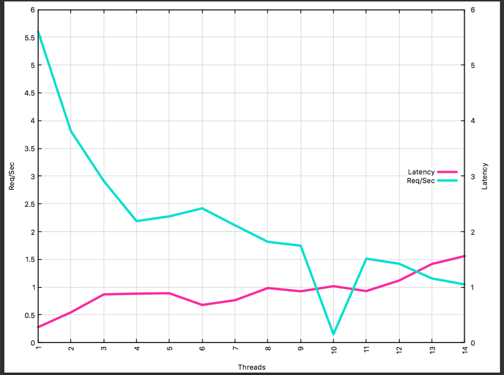
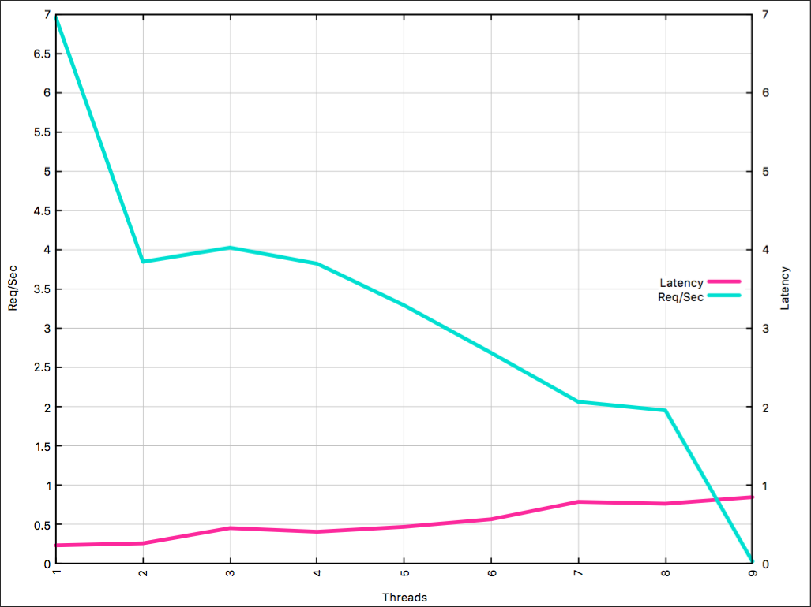
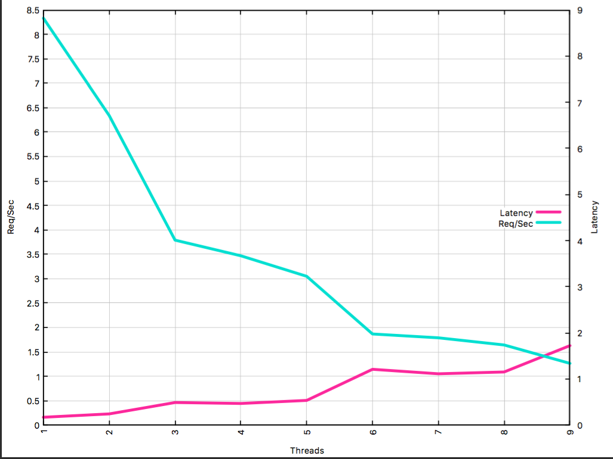
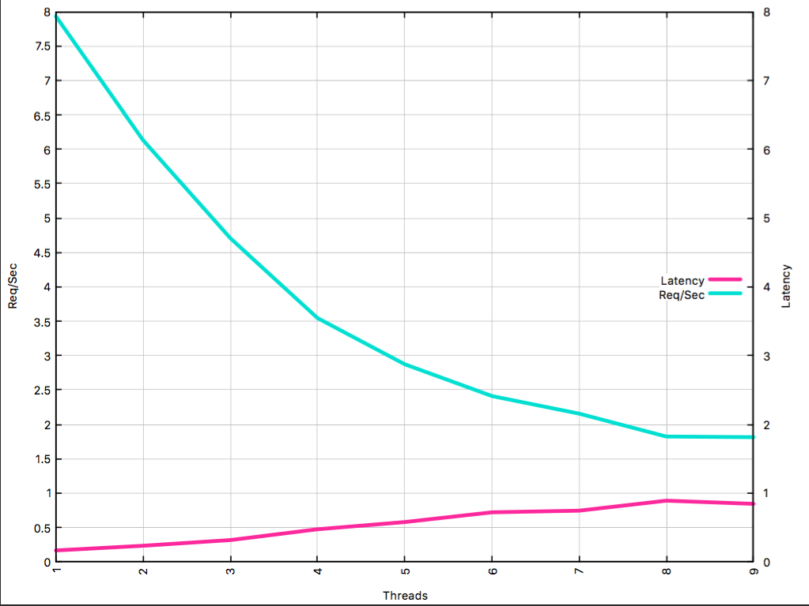
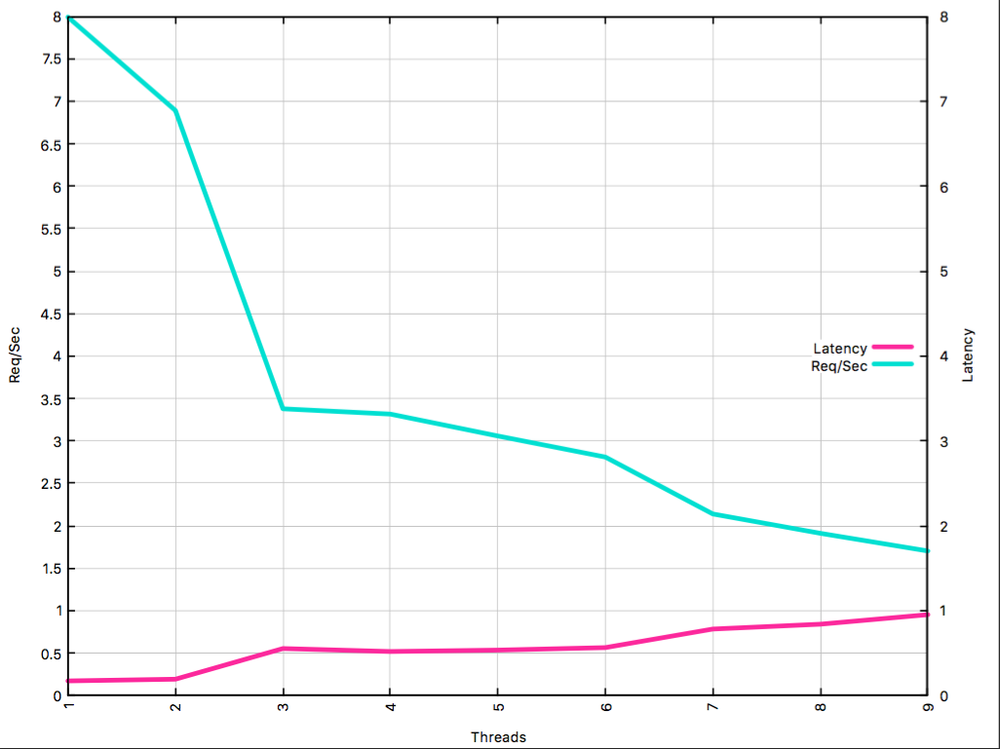

# HW6: Crank it Up

#### Completed by Eric Boettner and Vinay Gopalan

The goal of this project is to maximize our cache server's performance with multithreading and code optimization.

## Part 1 : Multi-Threaded Benchmark

The code for this part is provided in `threaded_generator.cc`. Our previous benchmarking function (`baseline_latencies`) is encapsulated in an independent thread `threaded_latencies` which saves all data in a `thread_data` struct. The thread sends `nreq` synchronous requests to the cache server and returns the stores vector of latencies in the `thread_data` struct object.

The `threaded_performance` function launches `nthreads` worker threads, and finds the 95th-percentile latency of all these latencies combined, as well as the combined throughput of all these threads. The result is returned as a tuple that stores the `hits`, the `reqs_per_sec` (combined throughput) and the `percentile_latency` (95th percentile). A combined graph showing the aggregate throughput and the 95th-latency as a function of `nthreads` is shown below. Note that the latency is measured in milliseconds and the throughput is measured in reqs/second:

## Part 2: Multithreaded Server

All the related code is found in `cache_server.cc`. To run multiple threads, we created a vector of threads in the `main()` function. The vector stored all the threads, each running the `http_server` function. The `http_server` function now makes a shared connection and moves the socket. In order to prevent data corruption, we initialized a global mutex for the cache and locked/unlocked it before/after any `set, delete and reset` requests. The locking/unlocking of the mutex is done in the public function `process_request` of the `http_connection` class.  

We tried to reproduce our graphs from Part 1 using the new server. We tried 1, 4, 6 and 8 threads for the server and produced combined graphs of the throughput and the 95th-percentile as a function of `nthreads` like in part 1. The latency is measured in milliseconds and the throughput is measured in reqs/second.

### 1 Thread:

### 4 Threads:

### 6 Threads:

### 8 Threads:

